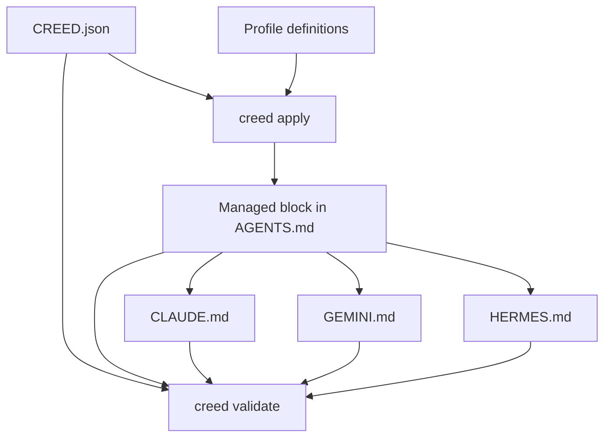

# creed

`creed` is a deterministic, offline Python tool for managing AI-dependency creeds in repositories. A repository declares its creed in `CREED.json`; `creed apply` renders the matching managed block into `AGENTS.md` and synchronizes `CLAUDE.md`, `GEMINI.md`, and `HERMES.md` as exact replicas. `creed validate` checks that the declaration, block, and mirrors agree.

This repository follows the `ai-augmented` creed: AI may assist development, but the shipped command-line tool is deterministic, uses no AI at runtime, and has no AI in its production dependency chain.

## Installation

Install the package from this repository:

```bash
python -m pip install -e .
```

The runtime code uses only the Python standard library and performs no network requests.

## Usage

Create `CREED.json` in the repository root:

```json
{
  "creed": "ai-augmented"
}
```

Then install or refresh the managed block and mirrors:

```bash
creed apply
```

Validate the declared creed, installed block, and mirror files:

```bash
creed validate
```

Override the declared creed for one application:

```bash
creed apply --creed ai-self-weaning
```

List the available creeds:

```bash
creed list
```

Print the exact managed block for one creed:

```bash
creed show ai-augmented
```

## Available Creeds

- `ai-native` — AI is the product's foundation in build and runtime.
- `ai-augmented` — AI assists the build; the shipped product is deterministic.
- `ai-escape-hatch` — Determinism is the default and AI is an explicit fallback.
- `ai-self-weaning` — AI use is captured and converted into durable deterministic rules over time.
- `ai-free` — No AI is used in build or runtime.

## Configuration Fields

Only `creed` is required. These optional Boolean fields may be added to `CREED.json`; when present, `creed validate` checks them against the selected creed:

- `ai_allowed_in_build`
- `ai_allowed_in_runtime`
- `crystallization_required`
- `labeled_gaps_required`
- `deterministic_fallback_required`
- `ai_may_establish_truth`

## Verification

Run the complete test suite:

```bash
python -m unittest discover -s tests
```

Verify this repository's own declaration:

```bash
creed validate
```

## Architecture

The command-line interface dispatches four operations:

- `list` prints the profiles in `creed/profiles.py`.
- `apply` reads `CREED.json`, renders the block, installs it with `creed/block.py`, and writes all mirrors.
- `validate` compares the installed block with the rendered expectation and compares every mirror byte-for-byte with `AGENTS.md`.
- `show` prints a rendered block without changing files.



## Status

Version 0.1.0 is the initial deterministic implementation. It is suitable for local repository governance and self-verification.
